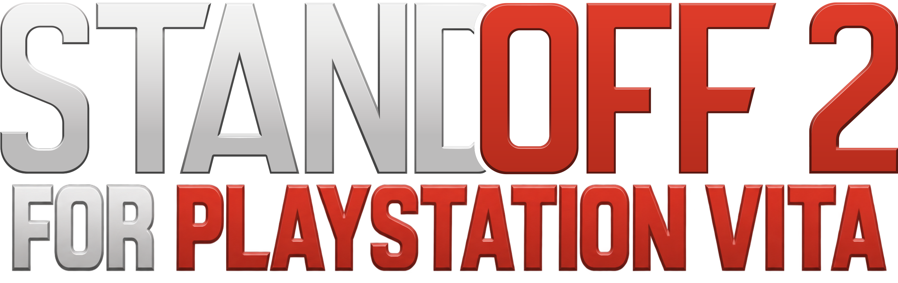

Standoff 2 0.6.2 port to PS VITA. This is an incomplete port that involves downgrading the game from Unity 2021 to Unity 2017.4 for PlayStation Vita compatibility.

## About the Project

standoff-vita is a community-driven project aimed at bringing Standoff 2 to PlayStation Vita. The game was originally built with Unity 2021, and this project focuses on compiling and adapting it for work on the PlayStation Vita platform.

## Status

This is an **incomplete** port. The project is still in active development, and there may be missing features, bugs, and compatibility issues. Use at your own risk.

## Requirements

- Unity 2017.4.x LTS
- PlayStation Vita SDK
- Basic knowledge of Unity development and PS Vita compilation

## Installation & Building

Instructions for building and installation will be added as the project progresses.

## Contributing

Contributions are welcome! Whether you're fixing bugs, improving performance, or helping with features, please feel free to:

1. Fork the repository
2. Create a feature branch (`git checkout -b feature/your-feature`)
3. Make your changes and commit them
4. Push to your branch and open a Pull Request

## Known Issues

As this is an incomplete port, there are likely numerous issues. Please check the Issues tab for known problems and feel free to report new ones.

## Disclaimer

This project is not affiliated with Standoff 2 developers.
